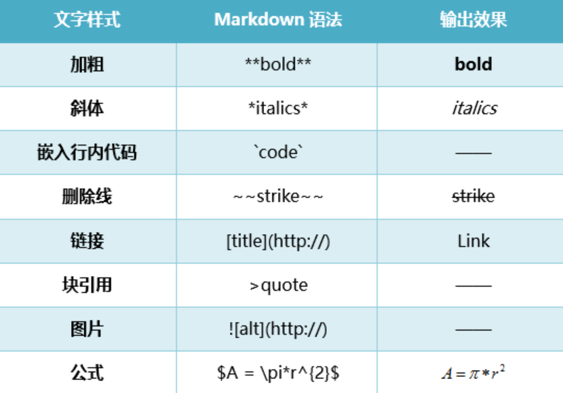
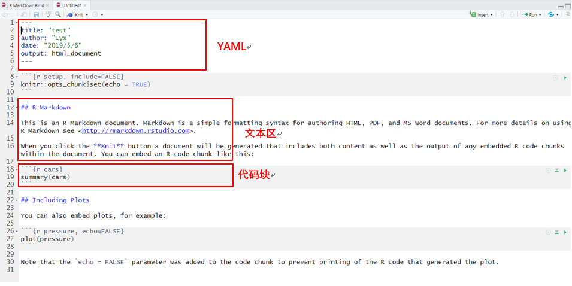
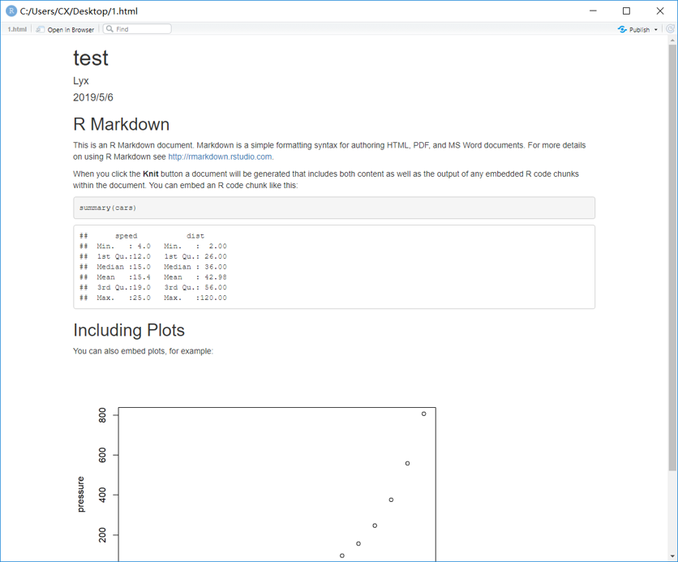
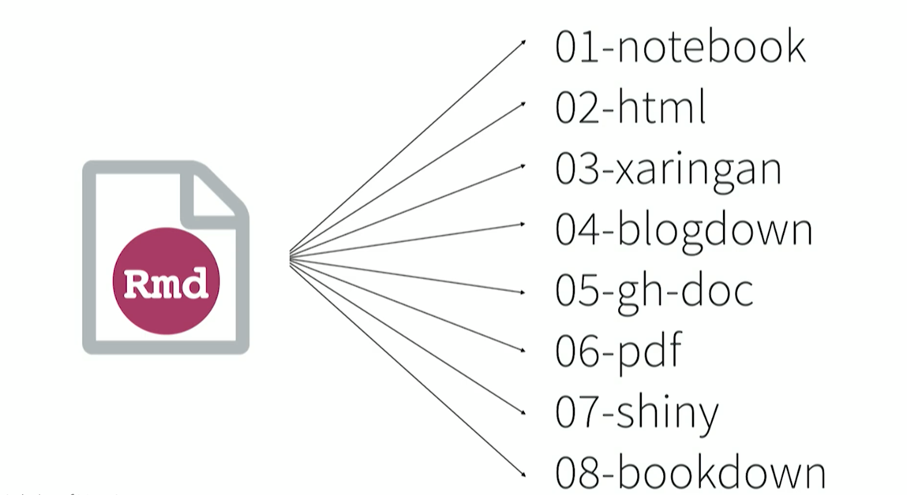
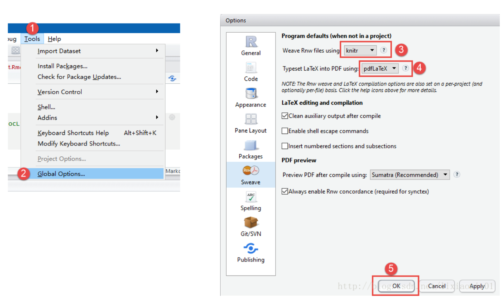
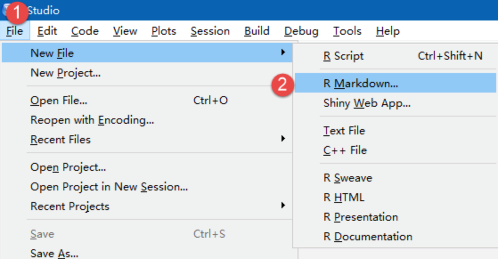
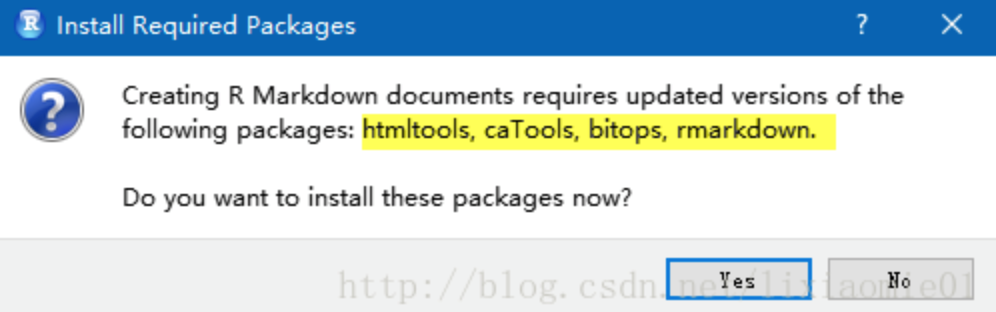

```{r setup, include=FALSE}
knitr::opts_chunk$set(echo = FALSE)
```


# Markdown：文本编辑 + 标记语言



---

# Rmarkdown：R代码 + markdown
R语言中cars包数据的总结：
```{r cars,echo=TRUE,eval=TRUE}
summary(cars)
```
---

# Rmarkdown基本结构

  

---

# 运行结果

 

---

# Why Rmarkdown？  

  
[八种输出方式]  [https://www.rstudio.com/resources/videos/r-markdown-eight-ways/]

---

# 应用
## 1.presentation

## 2.write paper

## 3.***reproducible research***

---

# 安装步骤1


---

# 安装步骤2


---

# 安装步骤3


---
# 小组成员：黄坤 罗宇翔 肖天雄 邢茹 徐嘉曦  

